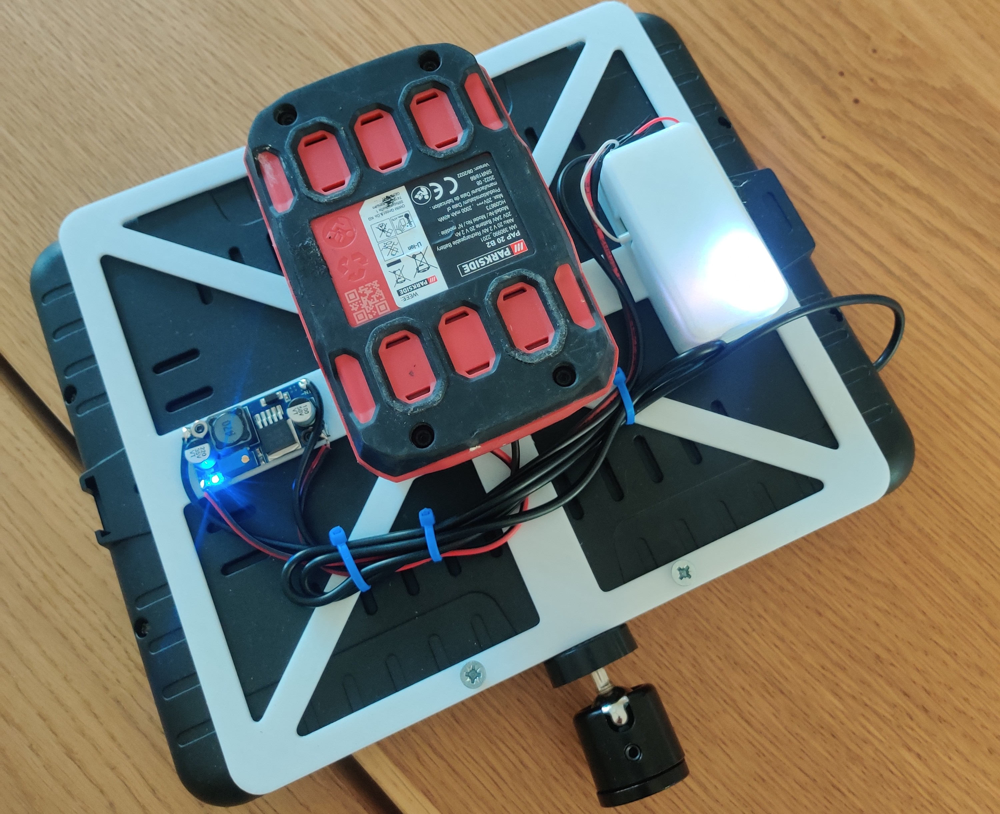

# DIY Smart LED Studio Lights 🔧💡

This project documents how I converted a cheap AliExpress LED studio panel into a **smart, WiFi-connected, Home Assistant-controlled light** using my custom hardware modules and 3D printed components.

   

The goal was to build a modular, open-source alternative to expensive smart lights — complete with **PWM dimming**, **warm/cool white mixing**, and **portable battery power**.

---

## 🧠 Features

- ESP32-C3-based control using the [**Sprig**](https://sprig-labs.com/sprig-esp32-development-board) dev board
- Dual-channel MOSFET switching via the [**Thorn**](https://sprig-labs.com/thorn-dual-mosfet-controller) module
- Independent control of warm and cool white LEDs
- Control and automation via **ESPHome + Home Assistant**
- DC-DC buck converter for battery regulation
- 3D printed mounting plate for the back of the LED panel
- Clean cable routing and screw mounting

---

## 📦 Bill of Materials (BOM)

| Component                   | Quantity | Notes                                |
|-----------------------------|----------|--------------------------------------|
| Sprig ESP32-C3 dev board    | 1        | Custom ESP32-C3 with USB-C & LiPo    |
| Thorn dual MOSFET board     | 1        | For switching LED channels           |
| AliExpress LED Panel        | 1        | Any standard 12V dual white model    |
| DC-DC Buck Converter        | 1        | e.g. XL4015, with adjustable output  |
| Parkside battery            | 1        | Or modify for your battery style     |
| M3 Screws & Nuts            | 4–6      | For mounting the plate               |
| Zip ties, wires, connectors | as needed| For clean connections                |

---

## 🖨️ 3D Printing

- **File:** `Smart_LED_Mount_Plate.stl`
- **Layer height:** 0.2 mm
- **Infill:** 20–30%
- **Supports:** Yes (for overhangs and screw holes)
- **Material:** PLA or PETG recommended

---

## ⚡ Wiring Guide

1. Connect the [Sprig](https://www.tindie.com/products/spriglabs/sprig-esp32-c3-development-board/) microcontroller to the [Thorn](https://www.tindie.com/products/spriglabs/thorn-dual-mosfet-controller/) module
2. Route the MOSFET outputs to the LED panel's warm and cool channels
3. Power the Sprig and LEDs via the buck converter from the battery
4. Optional: Add inline fuse or switch

---

## 📲 Software

- Firmware: **ESPHome**  
- Integrates directly with **Home Assistant**
- Example YAML config available [here](home-assistant-configuration.yaml)

---

## 🖼️ Gallery

Check the `images/` folder or my [Instructables project](https://www.instructables.com/DIY-Smart-Studio-LED-Panel-With-ESP32-and-Home-Ass/) for build photos and setup examples.

---

## 📎 License

This project is open-source under the **MIT License**.  
Feel free to remix, improve, and share.

---

## 🧠 About

Made by [Sprig Labs](https://sprig-labs.com) — merging coffee, electronics, and maker tools into useful DIY creations.
